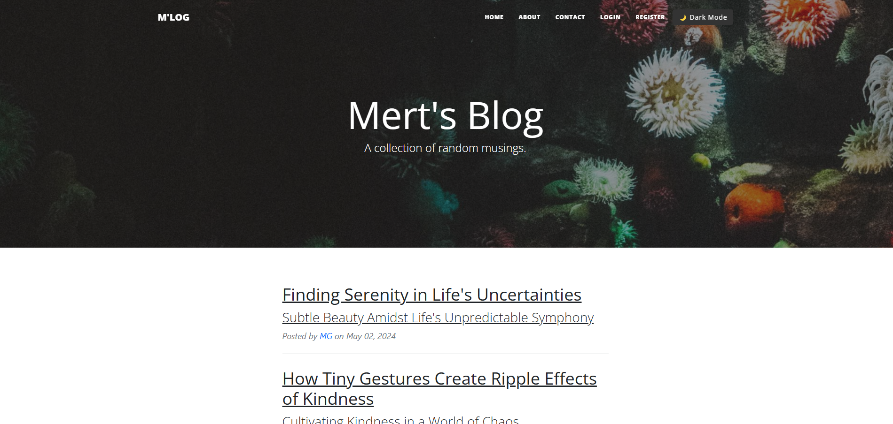
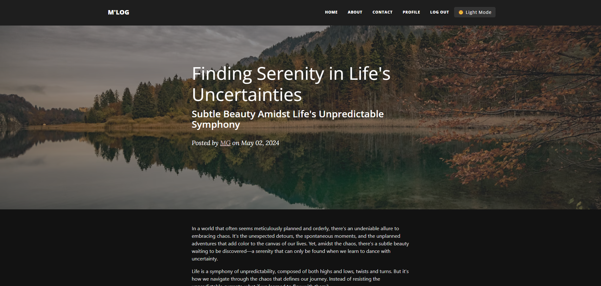
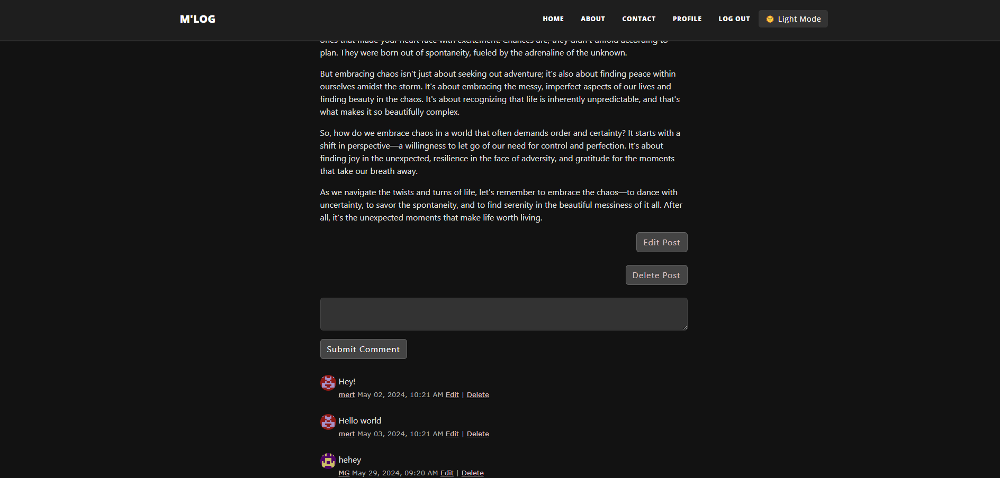

# Flask Blog Project

This project is a dynamic web application built using Flask, a lightweight Python web framework. It features user authentication, CRUD (Create, Read, Update, Delete) operations for blog posts, a commenting system, and a contact form for user inquiries via email.

### Homepage

### Blog Post Page in Dark Mode

## Features

- **User Authentication:** Secure registration, login, and logout functionality.
- **Blog Post Management:** Users can create, read, update, and delete their blog posts.
- **Commenting System:** Users can add comments to blog posts.
- **Contact Form:** Allows users to send messages via email.
- **Admin Role:** Special privileges for the admin to manage all blog posts and comments.
- **Profile Page:** Users can view and update their profile, including changing their password.
- **Flask Extensions:** Utilizes SQLAlchemy for ORM, Flask-Bootstrap for responsive design, CKEditor for rich text editing, and Flask-Gravatar for user avatars.

## Technologies Used

- **Backend:** Python, Flask, SQLAlchemy
- **Frontend:** Flask-Bootstrap, CKEditor
- **Extensions:** Flask-Login, Flask-WTF, Flask-Gravatar
- **Email:** smtplib, dotenv for environment variable management

## Usage

- **Home Page:** View all blog posts.
- **Post Details:** Click on a post to view details and comments.
- **Register/Login:** Register a new account or log in to an existing account.
- **Create/Edit/Delete Post:** After logging in, create new posts or edit/delete existing ones.
- **Contact:** Use the contact form to send an email message.
- **Profile Page:** View and update your profile, including changing your password.
- **Comments:** Add comments to posts.

### Comment section

## Admin Role

- The first registered user is assigned the admin role (user ID 1).
- **Admin Privileges:**
  - Create, edit, and delete any blog post.
  - Delete any comment.
  - Access to admin-specific routes such as managing all posts and comments.

