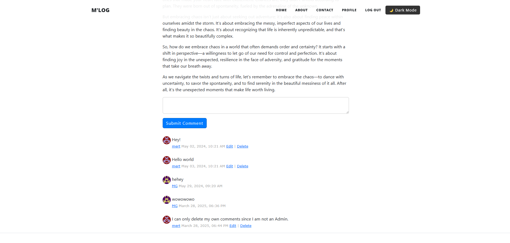

# Flask Blog Project

## About  
A Flask-powered blog platform with AI-based text summarization and full CRUD features for blogging.

---

### Homepage  

### Blog Post Page in Dark Mode  

## Features

- **User Authentication:** Secure registration, login, and logout.
- **AI Summarization:** Generate quick summaries of blog posts using Hugging Face Transformers.
- **Blog Post Management:** Create, read, update, and delete posts.
- **Commenting System:** Add comments to blog posts.
- **Contact Form:** Users can send messages via email.
- **Profile Page:** View and update user profiles and passwords.
- **Admin Role:** Admin can manage all posts and comments.

## Technologies Used

- **Backend:** Python, Flask, SQLAlchemy
- **Frontend:** Flask-Bootstrap, CKEditor
- **Extensions:** Flask-Login, Flask-WTF, Flask-Gravatar
- **AI/NLP:** Hugging Face Transformers (DistilBART for summarization)
- **Email:** smtplib, dotenv

## Usage

- **Home Page:** View all posts.
- **Post Detail:** Read full content and see comments.
- **Summarize Post:** Generate a summary with one click (admin-only or per-user depending on setup).
- **Register/Login:** Access content creation and commenting.
- **Profile Page:** Edit user details or change password.
- **Contact:** Submit inquiries via form.

### Comment section  

## Admin Role

- First user (ID 1) gets admin role.
- **Privileges:**
  - Create/edit/delete any post.
  - Delete any comment.
  - Access admin-only routes.

---

## ✨ New Feature: AI Summarization

Quickly generate concise summaries of blog posts with a single click using Hugging Face Transformers.

### AI Summarization Feature in Action  !

